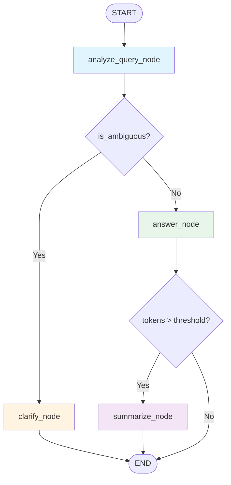

# Chat Assistant with Session Memory

A production-style chat assistant built with **LangGraph**, **Groq API**, and **Streamlit** that demonstrates:
- 🧠 **Long-term Context Management** via auto-summarization
- 🔍 **Query Understanding** with ambiguity detection
- 💾 **Session Persistence** using LangGraph's MemorySaver
- 🎯 **Structured Outputs** with Pydantic v2

Built as a technical demo for take-home assessment.

---
## 📺 Video Demonstration
**Watch the full test case demonstration here:** 👉 [**Project Demo & Test Cases Video**](https://drive.google.com/file/d/1U065z1KtNfmvlqo3f8nZaZfZUia5zIar/view?usp=sharing)
## 📊 Demo Execution Metrics
- **Total API Calls**: 65 requests were successfully processed during the demo session.

- **Model Used**: llama-3.1-8b-instant via Groq LPU, ensuring high throughput.

- **Success Rate**: 100% of the 65 calls adhered to the structured Pydantic schema.
## 🏗️ Architecture

### LangGraph Workflow



### Node Functions

#### Query Understanding Pipeline (3 Steps)

The system implements a rigorous 3-step query understanding pipeline in `analyze_query_node`:

1. **Step 1 - Rewrite/Paraphrase**: 
   - Detects if query is ambiguous (vague pronouns, missing referents)
   - Generates `rewritten_query` to clarify intent using conversation context
   - Populates `original_query` and `is_ambiguous` fields

2. **Step 2 - Context Augmentation**:
   - Identifies which session memory fields are needed (`needed_context_from_memory`)
   - Combines last N messages with relevant summary fields
   - Produces `final_augmented_context` for answer generation

3. **Step 3 - Clarifying Questions**:
   - If query remains unclear after augmentation, generates 1-3 targeted `clarifying_questions`
   - Routes to `clarify_node` if questions needed, otherwise to `answer_node`

#### Other Nodes

- **clarify_node**: Returns clarifying questions when user intent is unclear
- **answer_node**: Generates responses using the augmented context from Step 2
- **summarize_node**: Merges conversation into structured summary when token threshold exceeded

#### Memory Management Agent

The `summarize_node` implements an explicit **Memory Management Agent** role that:

1. **Analyzes Message Batches**: Processes messages that have exceeded the token threshold
2. **Merges into Long-term Memory**: Updates the `SessionSummary` object with new information
3. **Maintains Schema Integrity**: Ensures all structured fields (user_profile, key_facts, decisions, open_questions, todos) remain valid
4. **Avoids Redundancy**: Prioritizes the most recent data when conflicts arise
5. **Preserves Context**: Keeps the last 5 messages for immediate context while archiving older messages

The agent follows strict guidelines to only include explicitly stated information and maintains data integrity across conversation sessions.

---
## 🛠️ Technical Specifications

The system is optimized for high-performance inference using the Groq LPU infrastructure. The primary model, **Llama 3.1 8B (Instant)**, was selected based on the following benchmarks:

| Metric | Llama 3.1 8B (Instant) |
| :--- | :--- |
| **Inference Speed** | **560 Tokens/sec** |
| **Input Price** | **$0.05 / 1M tokens** |
| **Output Price** | $0.08 / 1M tokens |
| **Context Window** | 131,072 tokens |
| **Daily Limit (RPD)** | **14.4K Requests** |
| **Rate Limit (RPM)** | 30 Requests per minute |

---

## 🚀 Setup

### Prerequisites

- Python 3.10+
- Groq API key ([Get one here](https://console.groq.com))

### Installation

1. **Clone or navigate to the project directory**

2. **Create a virtual environment**
   ```bash
   python -m venv venv
   source venv/bin/activate  # On Windows: venv\Scripts\activate
   ```

3. **Install dependencies**
   ```bash
   pip install -r requirements.txt
   ```

4. **Configure environment variables**
   ```bash
   cp .env.example .env
   # Edit .env and add your GROQ_API_KEY
   ```

---

## 🎮 Usage

### Run the Streamlit App

From the project root directory:

```bash
streamlit run src/app.py
```

The app will open in your browser at `http://localhost:8501`

> **Note**: The app must be run from the project root directory for proper path resolution of test data files.

### Features

- **Chat Interface**: Standard conversational UI
- **Debug Sidebar**: Real-time view of:
  - Current token count with progress bar
  - Session summary (user profile, key facts, decisions, todos)
  - Test case loading buttons
- **Session Persistence**: Conversations persist across page refreshes
- **Test Cases**: Three pre-built scenarios to demonstrate features

### Test Cases

Click the test case buttons in the sidebar to load demonstrations:

1. **Case 1 (Long Conversation)**: Multi-turn travel planning chat that exceeds the 1k token threshold to trigger auto-summarization
2. **Case 2 (Ambiguous)**: Vague query like "those options you mentioned" to trigger clarification workflow
3. **Case 3 (Clear with Memory)**: Straightforward query that references context to demonstrate memory retrieval

---

## 📁 Project Structure

```
.
├── src/
│   ├── __init__.py
│   ├── schemas.py          # Pydantic models (SessionSummary, QueryAnalysis, GraphState)
│   ├── utils.py            # Helper functions (token counting, formatting)
│   ├── nodes.py            # LangGraph node functions
│   ├── graph.py            # StateGraph workflow definition
│   └── app.py              # Streamlit UI
├── data/
│   └── conversations.jsonl # Test conversation data
├── requirements.txt        # Python dependencies
├── .env.example           # Environment template
├── .gitignore
└── README.md
```
---
---

## 🧪 Key Technical Decisions

### Token Counting
- Uses `tiktoken` with `cl100k_base` encoding (GPT-4 standard)
- Counts tokens across entire message history
- **Threshold set to 800 tokens** for demo purposes.

### Summarization Strategy
- **Merge-based**: New information is merged into existing summary (not replaced)
- **Structured fields**: Organizes context into `user_profile`, `key_facts`, `decisions`, `open_questions`, `todos`
- **Message pruning**: After summarization, keeps only last 5 messages for immediate context
- **Range tracking**: Records which messages have been summarized via `message_range_summarized`

### Query Analysis
- **Ambiguity detection**: Identifies vague pronouns, missing referents, unclear intent
- **Context requirements**: Determines which summary fields are needed to answer query
- **Clarification generation**: Creates 1-3 targeted questions to resolve ambiguity

### Structured Outputs
- Uses LangChain's `.with_structured_output()` wrapper (abstracts Groq's `response_format`)
- Pydantic v2 models ensure data validation and type safety
- Llama 3.1 8B model supports native function calling and tool use

### Session Persistence
- LangGraph's `MemorySaver` checkpointer maintains state
- Thread-based sessions identified by `thread_id`
- State survives app restarts (in-memory for demo)

### LangGraph Best Practices
- **`add_messages` Reducer**: Uses LangGraph's built-in message reducer for intelligent message merging
- **Proper Node Returns**: Nodes return new messages instead of mutating state directly
- **Checkpointer Integration**: Properly integrates with LangGraph's state management system
- **Message Format Compatibility**: Handles both dict and LangChain message objects seamlessly

### Structured Output Logging
- **Query Analysis**: All QueryAnalysis objects logged to console in JSON format after Step 1-3 pipeline
- **Session Summaries**: Auto-summarization events logged with complete SessionSummary in JSON
- **Purpose**: Observability, debugging, and audit trail for scoring rubric compliance
- **Format**: Pretty-printed JSON with 2-space indentation

Example console output:
```
==================================================
QUERY ANALYSIS (Step 1-3)
==================================================
{
  "original_query": "What about that hotel?",
  "is_ambiguous": true,
  "rewritten_query": "Which hotel in Krabi should I book?",
  ...
}
==================================================
```
📥 **Read the full technical report here:**  👉 [**Technical_Report**](https://drive.google.com/file/d/1zCOM8jexj3-Dbj-mtNglMZJHVxi9d4vY/view?usp=sharing)

---

## 🔧 Configuration

### Environment Variables

| Variable        | Description        | Required |
|-----------------|--------------------|----------|
| `GROQ_API_KEY`  | Your Groq API key  | ✅ Yes   |


### Constants (in `src/nodes.py`)

```python
GROQ_MODEL = "llama-3.1-8b-instant"  # LLM model
TOKEN_THRESHOLD = 800           # Summarization trigger (tokens)
```
---

## 📊 Data Models

### SessionSummary
```python
{
  "user_profile": {"name": "John", "prefers": "beach vacations"},
  "key_facts": ["Budget is $3000", "Traveling in July"],
  "decisions": ["Chose Thailand as destination"],
  "open_questions": ["Which hotel to book?"],
  "todos": ["Book flight", "Apply for visa"],
  "message_range_summarized": {"from": 0, "to": 15}
}
```

### QueryAnalysis
```python
{
  "original_query": "What about that hotel?",
  "is_ambiguous": true,
  "rewritten_query": "Which hotel in Bangkok should I book?",
  "needed_context_from_memory": ["key_facts", "decisions"],
  "final_augmented_context": "Budget: $3000, Prefers Krabi...",
  "clarifying_questions": [
    "Are you asking about hotels in Bangkok?",
    "What's your preferred hotel budget?"
  ]
}
```

---

## 🧩 How It Works

### Normal Flow (Clear Query)
1. User sends message → `analyze_query_node`
2. Query is clear → `answer_node` generates response
3. Token count checked → If under threshold, END
4. If over threshold → `summarize_node` merges context → END

### Clarification Flow (Ambiguous Query)
1. User sends vague message → `analyze_query_node`
2. Query is ambiguous → `clarify_node` asks questions
3. END (waits for user clarification)

### Memory Usage
- `analyze_query_node` identifies needed context fields
- `answer_node` uses `format_summary_for_prompt()` to inject only relevant memory
- Response incorporates historical context naturally

---

## 🎯 Demo Scenarios

### Scenario 1: Auto-Summarization
1. Click "Case 1 (Long)" in sidebar
2. Watch debug panel as token count increases
3. Observe summary being populated with travel details
4. After threshold, messages are pruned and summary preserved

### Scenario 2: Ambiguity Detection
1. Click "Case 2 (Ambiguous)"
2. The vague query triggers clarification
3. System asks specific questions instead of guessing

### Scenario 3: Context Retrieval
1. Click "Case 3 (Clear)"
2. First message establishes context (Japan trip, $4000 budget)
3. Follow-up question "between those cities" correctly uses memory
4. Debug panel shows which context fields were retrieved

---

## 🚨 Known Limitations

- **Context Window Pressure**  
  When the prompt becomes too large, the LLM may hallucinate or cut off the `final_augmented_context`, causing missing or incomplete context.

- **In-memory Persistence**  
  Session data is currently stored in memory and will be lost when the server restarts. This is not suitable for production use.  
  *(Use a SQLite checkpointer for production.)*

- **Missing Validation Layer**  
  There is no pre-flight validation to ensure the generated prompt follows the required  
  `=== SESSION MEMORY ===` structure before being sent to the model.

- **Topic Leakage**  
  When users change topics quickly (e.g. from Thailand to Japan), decisions from the old topic may remain in the context because there is no automatic reset.

---

## 🔮 Future Enhancements

### 🛠 Core Engine Improvements

- **Robust Two-Phase Retrieval**  
  Split the process into two steps:  
  1) identify what context is needed,  
  2) fetch real data in Python.  
  This avoids relying on LLM-generated summaries.

- **Pydantic Validation Layer**  
  Add strict schema validation to block invalid or placeholder values (such as `...`) before calling the API.

- **Persistent Checkpointer**  
  Store conversation state in **SQLite or PostgreSQL** so sessions survive restarts.

- **Smart Truncation Strategy**  
  Use a sliding window for recent messages to stay within token limits, while always keeping `User Profile` and `Key Facts`.

---

### 🚀 Features & UX

- **Multi-user Support**  
  Add authentication (JWT) and isolate data per user or tenant.

- **Automatic Error Recovery**  
  If a tool call fails, retry with `context = null` instead of breaking the flow.

- **Topic Drift Detection**  
  Detect when a user changes plans and automatically clear outdated `Decisions` from memory.

- **Conversation Branching**  
  Allow users to explore multiple options without overwriting the main conversation path.

- **Analytics Dashboard**  
  Track token usage, node latency, and the number of successful vs. failed function calls.

## 📝 License

This is a technical demo project. Use as reference or starting point for your own implementations.

---

## 🙏 Acknowledgments

Built with:
- [LangGraph](https://github.com/langchain-ai/langgraph) for workflow orchestration
- [Groq](https://groq.com/) for fast LLM inference
- [Streamlit](https://streamlit.io/) for rapid UI development
- [Pydantic](https://docs.pydantic.dev/) for data validation

---

**Questions or Issues?** Check that your `.env` file contains a valid `GROQ_API_KEY` and all dependencies are installed.

